# 一个完整Fuzz过程 —— ok-file-formats

## 前言
本篇是之前写的《AFL笔记》（[上](https://bbs.pediy.com/thread-257399.htm)、[下](https://bbs.pediy.com/thread-259982.htm)）的后续，去年开始断断续续学习模糊测试写了两篇侧重分析Fuzz代码的笔记，这篇主要写一下这半年（很水的半年）的Fuzz过程总结的一些经验，用Git上的一个例子做解释：[ok_file_formats](https://github.com/brackeen/ok-file-formats)。有说的不对的地方，欢迎斧正，因为都是个人总结的一家之言，大家尽管吐槽就好。  

P.S.吐槽一下看雪的编辑器，没有找到草稿箱功能，之前写了一半，今天终于结束了实验课想补完，打开发现 GG，什么都没有了，只能重新整理思路从头再写一遍了。  

## 一、模糊测试
什么是模糊测试技术呢，就是用大量的随机输入去测试软件的健壮性等，最早是软件测试的概念。后来出现了afl，便出现了以覆盖率为导向的模糊测试技术。  

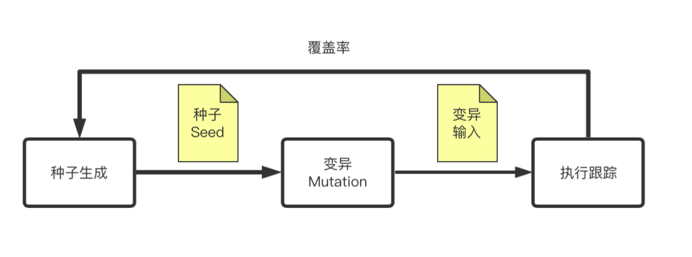  

看图可以很好的理解，最开始给afl初始种子，然后经过变异得到输入，将输入给到待测试程序，并通过插桩技术对程序跟踪，或者覆盖率，个人认为现在这个覆盖率已经变成了一个大的概念，可以是块覆盖、可以是边覆盖、可以是很多其他有利于程序输入的信息，只要是有利于变异和种子筛选的都可以算，然后覆盖率指导之前的流程，周而复始，直到遇到崩溃情况，便将其保存。  
这种覆盖率的想法使得输入不再是随机盲目的，可以说afl的出现使得模糊测试进入了新的阶段，虽然afl在2.52b版本之后就停止更新了，但是Google目前还一直维护着，而且后来出现了很多分支。今天用到的模糊测试工具就是AFL，其实其他工具使用思路也大同小异，都可以借鉴。  

## 二、Fuzz过程图
要想走完一个完整的Fuzz过程，不是仅仅知道上面说的原理就可以的做到的，还是要从整体的流程上进行说明才行。

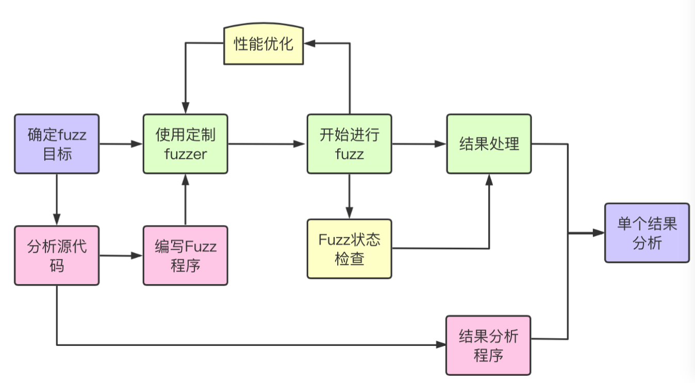  

整个流程是从确定fuzz目标开始，到单个crash分析结束，主要包含三部分：  
1. 浅绿色：主线流程，一般情况下确定好fuzz目标之后，就挑选合适到fuzzer，然后进行fuzz，这个fuzz的过程可长可短，视情况而定。最后可能一个crash都没有，也可能有好多crash，甚至会出现上百个，虽然fuzzer会说是unique crash，实际上很多情况下会出现很多触发相同漏洞的crash，这时候就需要进行一定的处理，得到真正的unique crash，然后再对单个结果进行分析。  
2. 粉红色：辅助流程，当确定了fuzz目标之后需要分析源代码，然后编写两段程序，分别是给fuzzer用的程序和验证漏洞用的内存检测程序。
3. 黄色：小工具类的使用，比如afl-whatsup、afl-plot、afl-cmin、afl-tmin、afl多线程等等。

## 三、选择目标程序
### 3.1 类型  
通常情况下要进行fuzz之前，应该先了解你的目标是什么样子的，代码量大还是小，开源还是闭源，属于文件读取类型还是协议类型，等等等等。下面列了一个表格是我所接触范围内的一个分类，当然随着研究的继续，这个表格会继续扩充。 

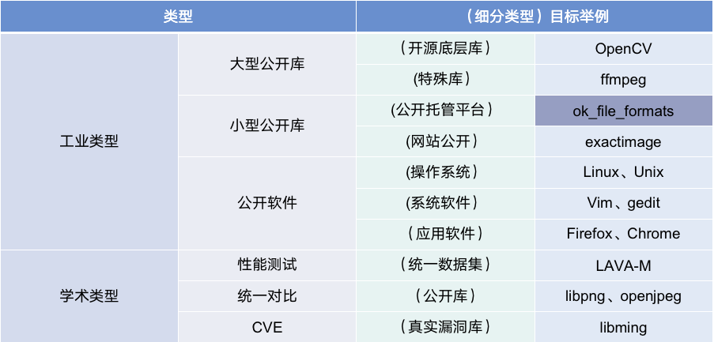   

>1). 工业类型  
&emsp;1.1). 大型公开库：主要是指那些调试安装都很麻烦的库，这类库的 fuzz 难点有三：  
&emsp;第一、漏洞少，这些库虽然都是开源的，但是因为用到的人很多，基本上都维护好多年了，很完善了已经，剩下的漏洞不多了，简单的洞肯定都被人挖出来了，所以跑出漏洞的概率有点点看运气；  
&emsp;第二、调试麻烦，随着项目的维护，很多公开库已经不再是当初单纯的单一功能，而且安装、使用都需要一定的学习时间成本，如果本身对这一类又不是很熟悉的情况下，浪费的时间会很多；  
&emsp;第三、体量大，因为项目涉及函数超级多，所以即使得到了crash，在分析crash是否可用的时候也会非常麻烦，有可能这个crash是因为引用的别的库的旧版本导致的。  
因此不管是从哪方面讲，大型公开库的Fuzz都是很有难度的，但是这也意味着一旦发现漏洞，那将是很宝贵的。下面举两个不同类型的例子的坑：  
&emsp;&emsp;1.1.1). 开源底层库 - OpenCV，刚过年的时候我尝试过用libfuzzer对其进行模糊测试，可以说这个库完全满足上面三点（笑哭），刚开始在编译阶段就把我卡了好久，再加上那时候也不太懂，就瞎搞，换了好几个docker容器，最后好不容易搭好了环境，开开心心的跑读取函数，最后有几个crash，一跟踪发现是个其他库的，而且还不是漏洞，就很气。。。  
&emsp;&emsp;1.1.2). 使用量大 - ffmpeg，有一类库虽然体积不大，但是用户基数超级大，ffmpeg就是属于这一类，毕竟微信传视频用的都是这个库，但是这一类的库就是上面说的第一条，漏洞极少，被这么多用户进行了检验，要想跑出洞，真的是超级难。  
&emsp;1.2). 小型公开库：与大型相对，就是指那类关注量小，使用量少的库。这一类库一般fuzz难度小，好编译，而且写测试程序也好写。我一般找这些库的方式有两种：  
&emsp;&emsp;1.2.1). 公开托管平台比如github、dockerhub上面的公开库或者软件，比如ok_file_mormats就是我等下要举的例子，就是来自GitHub。比如我要fuzz图像类型的库，就搜索png、jpg、img等等这类关键词，然后按照star多少的顺序排序，然后假设是想要C语言的库就在左侧选中只要C； 
&emsp;&emsp;1.2.1). 再有就是网站公开的一些库，这一类有自己的补丁版本，有小公司或者小团队维护，而且漏洞上报也不方便，我一般不选这一类，有这精力还不如搞大的；   
&emsp;1.3). 公开软件：这类我目前接触的不多，之后应该可能看看研究研究，我主要分了三类软件：一是针对操作系统，比如Linux、unix；二是针对常用系统软件，比如vim、gedit；三是通用应用软件，比如浏览器火狐、Chrome（还推荐一个方式，可以查Chrome用了哪些库，去测试那些库准没错）。  
2). 学术类型  
&emsp;2.1). 性能测试，一般采用统一数据集，像lava-m（基本上近几年的Fuzzing论文都跑这个库做性能测试），为了证明在普遍认同的同一情况下自己的fuzzer比别人好；  
&emsp;2.2). 统一对比，一般是用公开库，这时候一般用真实的库来对比，一般就放自己效果好的库，不考虑版本问题，不一定会用最新版本的库；  
&emsp;2.3). 为了CVE，一般是为了跑出真实的漏洞，挑选的多是上面工业类型里的小型库，有的时候一些顶会文章会涉及到大型库，不过感觉今年fuzzing的申请CVE开始变得好难了，不好搞呀；  

最后挑选的是一个文件转换库，其实严格意义上也不是个库了，算是个提供很多文件转换标准的函数汇总吧。第一是因为这个比较简单，内容少，好分析；第二是因为作者自己就做了一个test的文件夹，放了很多testcase，就免去了我们自己搜集了。  

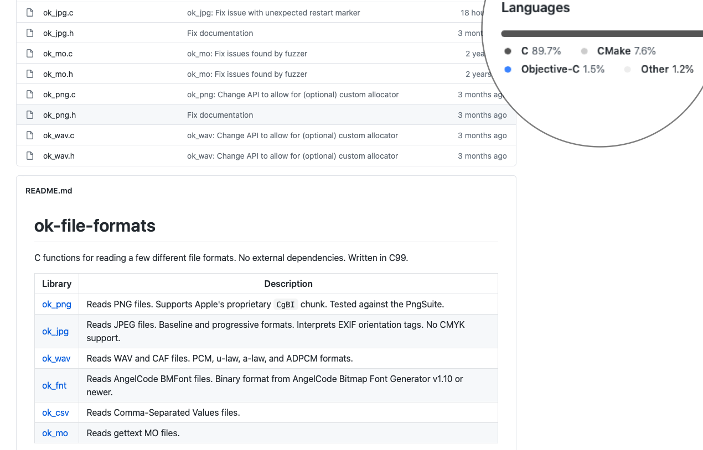

### 3.2 种子准备
当经过挑选之后找到了合适的目标程序，那么紧接着下一步一定是找初始种子了，这个种子的好坏其实说重要还是蛮重要的，如果fuzz的目标比较小，像这个ok-file-formats，可能用afl自带的图片testcase就够了，不过这个作者提供了一些之前能触发漏洞的testcase，可以说是非常有帮助了。  
当然并不是所以的软件作者都这么有良心，最好的办法就是积累，在fuzz的时候有同类型文件触发漏洞的可以考虑留下，给其他同类型库用，遇到合适的留下，久而久之就有不小的testcase库啦。  

## 四、挑选合适的Fuzzer
这一步我单独写一个章节是因为这里很重要，虽然说我们一直讨论的是用AFL相关，但是实际上在此基础上有很多很多的分支，我才疏学浅，这里就列一小部分（有兴趣可以找这三四年顶会的综述论文看一下，一定会有收获的）  

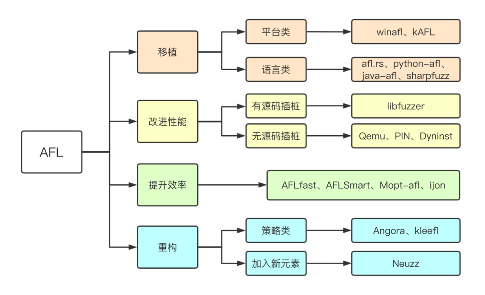  

关于AFL的分支，我这里分为四类（并不一定是afl转来了，但一定是受其思想影响的进步）：  
#### 移植
1. afl多是用在Linux的c语言类程序文件模糊测试，所以就有人做了平台移植：最经典的就是winafl，在Windows平台下的模糊测试工具；  
2. 还有针对语言的移植，比如针对rust语言的/afl.rs、针对python语言的python-afl、针对Java语言的java-afl、针对C#语言的sharpfuzz；  
#### 性能的改进
1. 这部分是指速度性能的改进，既有针对有源码的libfuzzer，通过用llvm、clang框架大大提升了性能，这部分Google自家的fuzzer做的算是很好了，还有honggfuzz，都是对afl的很大改进；
2. 也有针对无源码的，像Qemu、PIN、Dyninst这些工具的引入，尽管说afl自带的系统里有qemu等但是效率不理想，所以就有一些别的大牛单独做的新的分支，甚至还有跟Frida结合的应用；  
#### 提升效率
这部分每年都会看见论文的新花样，针对变异策略的、针对种子筛选的层出不穷，afl-smart、ijon等等，不管是加入符号执行还是对策略改进，实际上对afl给改动并不大。主要还是从理论上进行了设想，提出了新思路；  
#### 重构
1. 基本上跟原来对afl差别很大了，一种是对整个变异策略全部重建，比如Angora就是用rust语言重新写对，并且用了自己新对变异策略；  
2. 另一种是加入新元素，比如Neuzz这个就是加入了机器学习，再比如今年出现了一些对蓝牙的、对use设备对模糊测试；  

总结下来就是一二类属于实际应用类，比较注重运用，怎么用的舒服，用得快怎么来，三四类属于理论类，比较注意想法。这篇文章的fuzz目标是文件类型的，而且是个小库，就用afl就够了，算是抛砖引玉了。  

## 五、开始进行Fuzzing
前面都算是准备工作，接下来是真正的写代码的部分，先把代码clone下来：  
`git clone https://github.com/brackeen/ok-file-formats.git`  
查看readme和GitHub上浏览一下结构，分析一下，可以发现两个比较有意思的点：  
1. 项目总的readme不仅给出了项目介绍，还给出了一个简单的例子，这个例子就是我们的突破口，极大减少了学习时间，接下来的程序编写就可以借鉴这里的例子。  
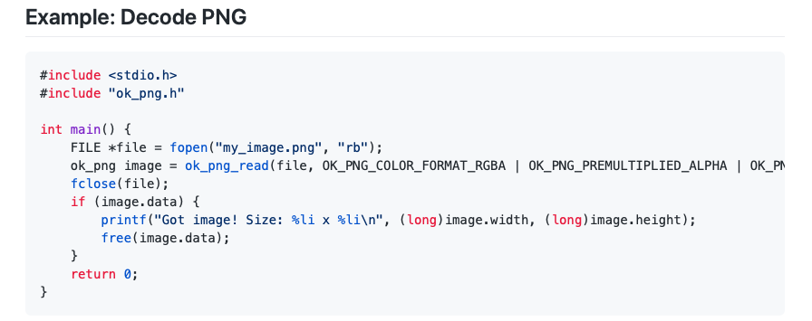  
2. 另外一个惊喜就是，在test文件夹下的readme，给出了关于如何fuzz的介绍，以及这些testcase怎么用，哪里来的等等。  
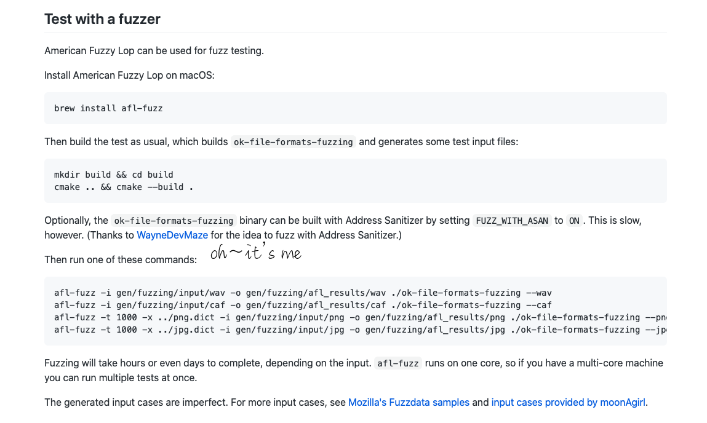  
就在我写这篇文章的时候发现，作者把我之前提交issue描述中有用的部分给加到描述里面了，有点小开心。  

### 5.1 编写Fuzz程序  
&emsp;接下来言归正传，现在知道了一个简单的例子，首先就来编写Fuzz用的程序，编写的这个程序的目的就是为了把要测试的函数加进去。我们照着葫芦画瓢，写一个读jpg文件的程序：  
```C
#include <stdio.h>
#include <stdlib.h>
#include "ok_jpg.h"
#include "ok_jpg.c"

int main(int _argc, char **_argv) {
    //把第一个参数当作文件名，这个名就是个相对路径，不过在fuzz的时候可以用@@来代替
    FILE *file = fopen(_argv[1], "rb");
    //读取jpg格式图片
    ok_jpg image = ok_jpg_read(file, OK_JPG_COLOR_FORMAT_RGBA);
    fclose(file);
    if (image.data) {
        printf("Got image! Size: %li x %li\n", (long)image.width, (long)image.height);
        free(image.data);
    }
    return 0;
}
```
把作者给的例子简单改一下，原来用的是绝对的文件名，这里改为传入的第一个参数，关于这个`_argv`,[0]、[1]的区别有点像shell里的$0、$1，传入的第一个参数是`_argv[1]`，而不是`_argv[0]`。然后下一行的读取，换成了在 ok_jpg.h 里的 ok_jpg_read 函数。  
编写完之后开始编译代码，这里项目很小，就不整那些花里胡哨的CMake了（以后有机会再专门分享一篇关于fuzz的时候编译的总结），直接用 afl-gcc 进行编译：  
```
afl-gcc -g -o fuzz_jpg main.c ok_jpg.c  ok_jpg.h
```  
编译完成之后，就得到将要进行fuzz的目标程序 fuzz_jpg。  

### 5.2 用 AFL 进行Fuzz  

开始fuzz之前，可以先测试一下程序是否正常：
```
./fuzz_jpg jpg/2001-stargate.jpg
```
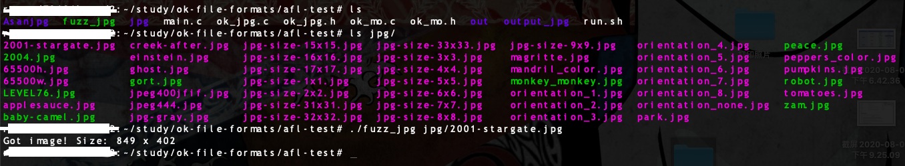  
使用命令开始fuzz：
```
afl-fuzz -m none -t 1000 -i jpg -o out ./fuzz_jpg @@
```
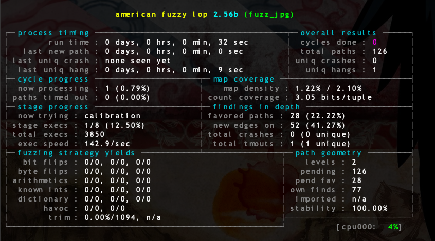  
前面也说到了，第一个参数可以用@@来代替，@@所代表传入的是变异后的输入的文件相对路径。  

关于AFL的使用我就不详细说了，这方面的资料太多了，如果没有用过，可以先看一下这篇，试着走一遍流程比较好：https://www.cnblogs.com/wayne-tao/p/11739420.html ，我在这篇文章后面写了一些对于报错的处理，如果还遇到什么奇奇怪怪的问题可以在评论区说一下，大家探讨探讨。

### 5.3 性能优化
在Fuzz的过程中会遇到一些效率问题，有的则可以通过改进来解决。
#### 种子筛选  
像5.2的图里所示，我用到的测试用例是jpg文件夹下的图片，这些图片都是从这个项目的test文件夹下找的，下面我们可以用 afl-cmin 和 afl-tmin 工具分别对这些测试用例实现“测试集精简化”、“测试用例最小化”，命令如下（在跟afl-fuzz一样的目录下）：  
```bash
#cmin
afl-cmin -i jpg -o newjpg ./fuzz_jpg @@
#处理完成
mv jpg cmin_jpg
mv newjpg jpg
#tmin
afl-tmin -d 1 -i jpg -o newjpg ./fuzz_jpg @@
#处理完成
mv jpg tmin_jpg
mv newjpg jpg
```
关于cmin和tmin的使用如果不太懂可以看一下我的这一篇文章：https://www.cnblogs.com/wayne-tao/p/11889718.html ，他们的使用做了详细解释。  

>注：我这里的用了一个新的参数 -d，因为原版只有针对单个文件的，我稍微改了下，可以对文件夹处理。  

#### 多线程  
afl 自带了多线程的方式，通过设置主进程（-M）和从属进程（-S）来设置多个进程一起Fuzz，参数后面加名称（这个名称会在-o输出文件夹里单独用这个作为文件夹命令）：  
```bash
afl-fuzz -m none -t 500 -i jpg -o out -M fuzzM ./fuzz_jpg @@
```  
因为服务器的核比较多，我一般是先写一个简单的脚本，然后再整，这样快一点点  
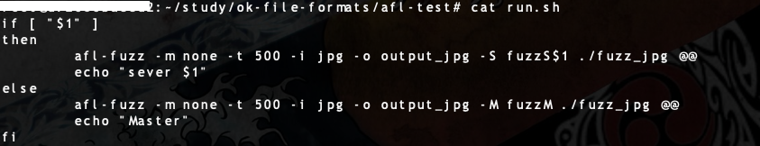

### 5.4 查看Fuzz状态  
进入Fuzz阶段之后，看到crash就停吗？万一没有看到crash呢？那么多进程要一个一个检查吗？  
肯定不是的，首先要确定一个fuzz过程是不是该停止了最直观的办法是看右上角的cycle done，不是看数字，而是看颜色，当变成绿色的时候基本上就该停了，没多少新路径可以给你用了，这时候不管有没有crash其实再继续意义也不大了，不能说不可能有crash，只是几率极低了。  

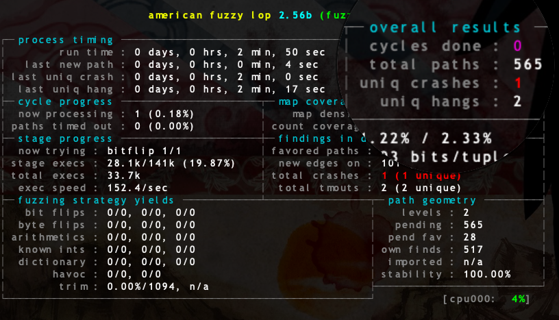

#### afl-whatsup  
开了很多进程，比如30个，即使是用了screen，也不能一下一下的点这看吧，所以用afl-whatsup是最方便的方式，可以看到实时的fuzz进展。
```bash
afl-whatsup out_dir
#这里的out_dir是-o参数后面的，而不是-M或者-S后面的
```

#### afl-plot
还有一个工具afl-plot，论文上会经常看到一些图标，而且很多论文图表格式都一致，其实是afl-plot工具制作的，他会制作一个网页，下面带着三张图，就像这样 

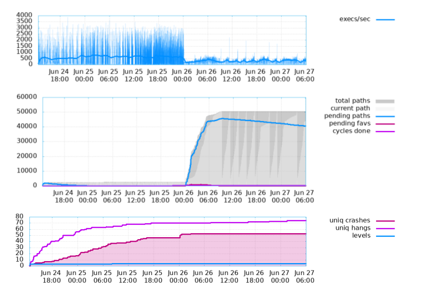  

可以看到在26号凌晨五六点的时候其实我关了的话也可以，后面基本上没什么执行效率的波动了，所以这个形式比看颜色应该是稍微精准那么一点点。  

## 六、结果分析
到这里开始Fuzz了，也说了一下在这过程中的一些小细节，那么如果跑出了crash该怎么处理呢，这一步就比较重要了，这一块算是自己摸索出来的一些小经验，希望可以帮到大家。  
### 6.1 验证程序
首先，拿到crash文件之后（就是那个id开头的那一串），要想知道这个crash好不好，有没有触发漏洞需要验证一下，怎么验证呢，这时候就需要一个叫做Asan的工具（Address Sanitizer），目前好像是Google在管理，而且已经集成到gcc自带了。是一个内存检测的工具，可以把程序异常很好的展现出来。
同样是之前编写的fuzz程序的那段代码，我们这一次不用afl-gcc编译了，用gcc编译，因为目的不同，这次是为了验证漏洞，所以加上Asan的选项：
```bash
gcc -g -fsanitize=address -fno-omit-frame-pointer -O1 -o Asanjpg main.c ok_jpg.c  ok_jpg.h
```
这时候就得到了一个内存检测的验证程序了：Asanjpg，验证程序地址：https://github.com/WayneDevMaze/afl_test_works/blob/master/OKfileformat/Asanjpg/Asanjpg 。  

一般情况下就是这么个套路，验证程序跟Fuzz测试程序在核心函数上没有区别，区别就是编译过程的不同，有时候也会在文件读取方式那里稍微做一下改动。

### 6.2 crash处理
当得到验证程序之后，就可以开始处理crash了，crash其实就是 out_dir/master/crash 下的文件，以id开头，有编号，我们把这个文件copy出来之后，放到Asanjpg同文件夹下（我这里就用已经验证过的了，自己做测试的时候只需要改文件名即可，[crash/poc地址](https://github.com/WayneDevMaze/afl_test_works/blob/master/OKfileformat/Asanjpg/crash/jpg-heap-buffer-overflow-1)），并运行：
```bash
./Asanjpg crash/jpg-heap-buffer-overflow-1
```
可以看到内存检测的输出：
```c
==98287==ERROR: AddressSanitizer: heap-buffer-overflow on address 0x631000039680 at pc 0x562394639b54 bp 0x7ffee24654e0 sp 0x7ffee24654d0
READ of size 2 at 0x631000039680 thread T0
    #0 0x562394639b53 in ok_jpg_decode_block_subsequent_scan /root/study/ok-file-formats/afl-test/ok_jpg.c:1102
    #1 0x56239463b11f in ok_jpg_decode_scan /root/study/ok-file-formats/afl-test/ok_jpg.c:1238
    #2 0x56239463fc60 in ok_jpg_read_sos /root/study/ok-file-formats/afl-test/ok_jpg.c:1734
    #3 0x562394640d3c in ok_jpg_decode2 /root/study/ok-file-formats/afl-test/ok_jpg.c:1900
    #4 0x562394641605 in ok_jpg_decode /root/study/ok-file-formats/afl-test/ok_jpg.c:1990
    #5 0x5623946308a4 in ok_jpg_read_with_allocator /root/study/ok-file-formats/afl-test/ok_jpg.c:268
    #6 0x56239463071b in ok_jpg_read /root/study/ok-file-formats/afl-test/ok_jpg.c:257
    #7 0x56239462fd5e in main /root/study/ok-file-formats/afl-test/main.c:8
    #8 0x7fe63f9a4b96 in __libc_start_main (/lib/x86_64-linux-gnu/libc.so.6+0x21b96)
    #9 0x56239462fb29 in _start (/root/study/ok-file-formats/afl-test/Asanjpg/Asanjpg+0x2b29)

0x631000039680 is located 113 bytes to the right of 69135-byte region [0x631000028800,0x63100003960f)
allocated by thread T0 here:
    #0 0x7fe63fe52b40 in __interceptor_malloc (/usr/lib/x86_64-linux-gnu/libasan.so.4+0xdeb40)
    #1 0x56239462ff00 in ok_stdlib_alloc /root/study/ok-file-formats/afl-test/ok_jpg.c:55
    #2 0x56239463eb20 in ok_jpg_read_sof /root/study/ok-file-formats/afl-test/ok_jpg.c:1595
    #3 0x562394640ac2 in ok_jpg_decode2 /root/study/ok-file-formats/afl-test/ok_jpg.c:1884
    #4 0x562394641605 in ok_jpg_decode /root/study/ok-file-formats/afl-test/ok_jpg.c:1990
    #5 0x5623946308a4 in ok_jpg_read_with_allocator /root/study/ok-file-formats/afl-test/ok_jpg.c:268
    #6 0x56239463071b in ok_jpg_read /root/study/ok-file-formats/afl-test/ok_jpg.c:257
    #7 0x56239462fd5e in main /root/study/ok-file-formats/afl-test/main.c:8
    #8 0x7fe63f9a4b96 in __libc_start_main (/lib/x86_64-linux-gnu/libc.so.6+0x21b96)

SUMMARY: AddressSanitizer: heap-buffer-overflow /root/study/ok-file-formats/afl-test/ok_jpg.c:1102 in ok_jpg_decode_block_subsequent_scan
Shadow bytes around the buggy address:
  0x0c627ffff280: 00 00 00 00 00 00 00 00 00 00 00 00 00 00 00 00
  0x0c627ffff290: 00 00 00 00 00 00 00 00 00 00 00 00 00 00 00 00
  0x0c627ffff2a0: 00 00 00 00 00 00 00 00 00 00 00 00 00 00 00 00
  0x0c627ffff2b0: 00 00 00 00 00 00 00 00 00 00 00 00 00 00 00 00
  0x0c627ffff2c0: 00 07 fa fa fa fa fa fa fa fa fa fa fa fa fa fa
=>0x0c627ffff2d0:[fa]fa fa fa fa fa fa fa fa fa fa fa fa fa fa fa
  0x0c627ffff2e0: fa fa fa fa fa fa fa fa fa fa fa fa fa fa fa fa
  0x0c627ffff2f0: fa fa fa fa fa fa fa fa fa fa fa fa fa fa fa fa
  0x0c627ffff300: fa fa fa fa fa fa fa fa fa fa fa fa fa fa fa fa
  0x0c627ffff310: fa fa fa fa fa fa fa fa fa fa fa fa fa fa fa fa
  0x0c627ffff320: fa fa fa fa fa fa fa fa fa fa fa fa fa fa fa fa
Shadow byte legend (one shadow byte represents 8 application bytes):
  Addressable:           00
  Partially addressable: 01 02 03 04 05 06 07
  Heap left redzone:       fa
  Freed heap region:       fd
  Stack left redzone:      f1
  Stack mid redzone:       f2
  Stack right redzone:     f3
  Stack after return:      f5
  Stack use after scope:   f8
  Global redzone:          f9
  Global init order:       f6
  Poisoned by user:        f7
  Container overflow:      fc
  Array cookie:            ac
  Intra object redzone:    bb
  ASan internal:           fe
  Left alloca redzone:     ca
  Right alloca redzone:    cb
==98287==ABORTING
```

第一、可以从SUMMARY看出这个crash是不是有价值，有时候报一些莫名其妙的没有价值的错还需要用gdb进一步调试，当然我一般懒得调试（好吧其实是我技术不到位分析不出啥东西来）；  
第二、在第一段中给出了触发位置的详细调用过程，如果想写exp，这一块比较重要，我现在不是很了解这部分，不敢说太多；  
第三、并不是所有的crash都可以报这种错误，有时候就是仅仅是文件类型不匹配等等问题，这时候crash其实就没什么用；  
第四、**重复crash**，这里着重说一下，我现在在做的一个小工具（正在验证中），请看截图：  

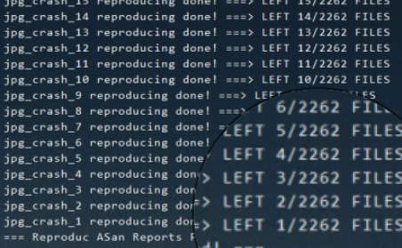  

可以看到20个线程，最后生成了2262个crash，经过前十几个的验证，发现重复性特别高，虽然crash文件内容不一样，但是触发的漏洞位置一模一样，这种crash其实并不unique，而且很多crash并不能触发真正的漏洞，是假crash，所以最近在做一个筛选出真正独一无二crash的工具。

### 6.3 漏洞提交issue
当得到6.2中的Asan报告之后，就可以认为触发了堆溢出漏洞，可以在GitHub上给作者提交issue了，最后贴一下我提交issue的大概内容（加注释）  
[issue地址](https://github.com/brackeen/ok-file-formats/issues/7)  

>
># Describe 【漏洞描述】
>A heap-buffer-overflow was discovered in ok_file_formats. The issue is being triggered in function ok_jpg_decode_block_subsequent_scan() at ok_jpg.c:1102  
>**这部分放漏洞的总述，把漏洞类型、漏洞触发函数位置、漏洞所在文件列出来；** 
># Reproduce 【复现过程所需内容】
>**test program**  
>```C
>#include <stdio.h>
>int main(int _argc, char **_argv) {}
>```
>**我一般是把验证程序放在这里，好让作者可以自己reproduce-复现；**  
>Tested in Ubuntu 18.04, 64bit.   
>Compile test program with address sanitizer with this command:  
>```bash
>gcc -g -fsanitize=address -fno-omit-frame-pointer -O1 -o Asanjpg main.c ok_jpg.c  ok_jpg.h
>```
>**告诉作者使用的，以及编译的环境和方法；**  
>You can get program [here](https://github.com/WayneDevMaze/afl_test_works/blob/master/OKfileformat/Asanjpg/Asanjpg).  
>**为了方便作者验证漏洞，我也会把编译好的程序放出来**  
># ASan Reports 【验证程序报的内存报告】
>```bash
>./Asanjpg crash/jpg-heap-buffer-overflow-1
>```
>Get ASan reports  
>```bash
>==98287==ABORTING
>```
>**这里就放Asanjpg验证之后报的内容，就是6.2里报的内存错误跟踪信息**  
># Poc 【其实就是crash文件】
>Poc file is [here](https://github.com/WayneDevMaze/afl_test_works/blob/master/OKfileformat/Asanjpg/crash/jpg-heap-buffer-overflow-1).   
>**最后一定要放出poc文件，总结下来一定要有的：漏洞描述、复现验证程序及源代码、报错信息（不一定非得是ASan的结果，也可以是gdb调试信息）、POC文件（触发漏洞的crash文件）**  
> &emsp;

当然如果Fuzz的程序比较知名，可以尝试申请CVE，我这个尝试申请了，但是没有回信，应该是凉了。

## 结语
总体来说，整个Fuzz过程熟悉一遍之后就变得不那么复杂了，还记得刚过年的时候我还是一头雾水，现在对小型库的fuzz已经比较有信心了，希望大家看完本文能有所帮助。  

[GitHub-AFL源码阅读笔记](https://github.com/WayneDevMaze/Chinese_noted_AFL)文中说的想要做的工具，完成后应该会放在这，欢迎star；  
[Fuzz学习过程随笔](https://www.cnblogs.com/wayne-tao/tag/AFL学习/)记录自己在学习过程中遇到的坑和一些心得；